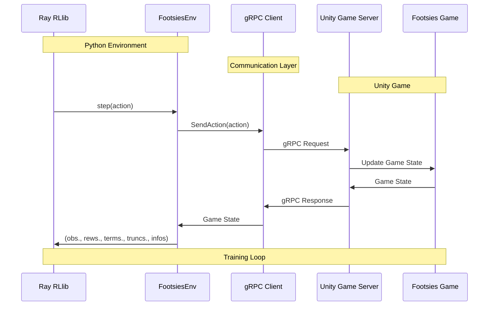

# FootsiesGym

Implementation of HiFight's [Footsies](https://hifight.github.io/footsies/) game as a reinforcement learning environment. This environment serves as a benchmark for multi-agent reinforcement learning in a (relatively) complex two-player zero-sum game.

The environment is derived from the open-source Unity implementation, which has been augmented to run a gRPC server that can be controlled through a Python harness. Training is implemented using Ray's [RLlib](https://docs.ray.io/en/latest/rllib/index.html).


### System Architecture



The diagram above shows how the different components interact during training:
1. RLlib sends actions to the FootsiesEnv
2. The environment converts these actions into gRPC requests
3. The Unity Game Server processes the actions and updates the game state
4. The game state is sent back through gRPC to the environment
5. The environment processes the observation and returns it to RLlib


## Installation

```bash
conda create -n footsiesgym python=3.10
conda activate footsiesgym
pip install -r requirements.txt
```

On a Mac, you may need to ensure you have `cmake` installed. You can install it using Homebrew:

```bash
brew install cmake
```

## Training

### Game Servers

Before training, you'll need to launch the headless game servers. A script is provided to do so in `scripts/start_local_{mac, linux}_servers.sh`, but you must first unpack the binaries that are included . The `start_local_servers.sh` script assumes that you have unpacked the contents into `~/footsies_binaries`.

```bash
./scripts/start_local_servers.sh <num-train-servers> <num-eval-servers>
```

The two arguments correspond to `num_env_runners` and `evaluation_num_env_runners`, which can be specified in the experiment configuration. You must launch a corresponding number of servers for each. The `start_local_servers.sh` script will start:
- Training servers from port 50051 (incrementing for each server)
- Evaluation servers from port 40051 (incrementing for each server)

The environment will use worker indices to determine which game server to connect to.

_Note_: All training runs have been tested with an RTX 3090 and 24-core Threadripper, supporting 40 training environments and 5 evaluation environments with 40-65% utilization per-core.

### Training Configuration

The default training setup uses:
- LSTM-based neural network architecture
- APPO (Asynchronous Proximal Policy Optimization) algorithm
- Self-play training paradigm
- Distributed training with Ray RLlib

To launch a new experiment:

```bash
python -m experiments.train --experiment-name <experiment-name>
```

Add the `--debug` flag to use only a single env runner and local mode. Using the experiment name `test` in debug mode will avoid creating too many experiments in `ray_results`.


## Visualizing a Policy

To visualize gameplay:

1. Unpack the windowed build binaries (`binaries/footsies_linux_windowed_021725.zip`) to your preferred location.

2. Add the trained policy specification to the `ModuleRepository` in `components/module_repository.py`:
```python
FootsiesModuleSpec(
    module_name="<policy-nickname>",
    experiment_name="<experiment-name>",
    trial_id="<trial-id>",  # specify if experiment has multiple trials
    checkpoint_number=-1,  # -1 for latest, otherwise specify checkpoint number
)
```

3. Run the game with:
```bash
./footsies_linux_windowed_021725 --port 80051
```

4. Configure policies in `scripts/local_inference.py` using the `MODULES` variable. Set `"p1"` to `"human"` to play against the AI.


## Project Architecture

### Core Components

- **Environment (`footsies/`)**: The main game environment implementation that interfaces with the Unity game through gRPC.
- **Models (`models/`)**: Neural network architectures for the RL agents
- **Experiments (`experiments/`)**: Training configurations and experiment management
- **Callbacks (`callbacks/`)**: Custom RLlib callbacks for monitoring and evaluation
- **Components (`components/`)**: Reusable components like the module repository for policy management
- **Utils (`utils/`)**: Utility functions and helper classes
- **Scripts (`scripts/`)**: Helper scripts for server management and visualization

### Key Features

- Multi-agent reinforcement learning environment
- gRPC-based communication with Unity game server
- Support for both headless and windowed game modes
- Integration with Ray RLlib for distributed training
- Custom LSTM-based policy networks
- Support for self-play training
- Evaluation against baseline policies (random, noop, back)
- Wandb integration for experiment tracking


## Development

### gRPC / Protobuf Updates

If updating the proto definitions:

1. Generate C# files (Windows):
```bash
.\protoc\bin\protoc.exe --csharp_out=.\env\game\proto\ --grpc_out=.\env\game\proto\ --plugin=protoc-gen-grpc=.\plugins\grpc_csharp_plugin.exe .\env\game\proto\footsies_service.proto
```

2. Generate Python files:
```bash
python -m grpc_tools.protoc -I. --python_out=. --grpc_python_out=. .\env\game\proto\footsies_service.proto
```

## Project Structure

```
FootsiesGym/
├── binaries/           # Game server binaries
├── callbacks/          # RLlib callbacks
├── components/         # Reusable components
├── experiments/        # Training configurations
├── footsies/          # Core environment
├── models/            # Neural network architectures
├── plugins/           # gRPC plugins
├── protoc/            # Protocol buffer tools
├── scripts/           # Helper scripts
├── testing/           # Test files
└── utils/             # Utility functions
```

## Contributing

1. Install pre-commit hooks to maintain code quality
2. Follow the existing code style and architecture
3. Add tests for new features
4. Update documentation as needed

## License

This project is based on the open-source Footsies game by HiFight. Please refer to the original game's license for more information.
